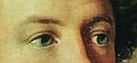
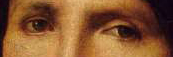
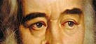

# game
<!DOCTYPE html>
<html>
<head>
<meta charset="utf-8">
<title>Слитно или раздельно?</title>

</head>

<body>

<h1>Писатель или машинист?</h1>

 Попробуйте угадать, чьи глаза изображены перед вами

<button class="button" onclick="startGame()">Начать игру</button>

  

Писатель или машинист?

<button class="button" onclick='test(true, 1)'>Писатель</button>
<button class="button" onclick='test(false, 1)'>Машинист</button>

  

  

Писатель или машинист?

<button class="button" onclick='test(false, 2)'>Писатель</button>
<button class="button" onclick='test(true, 2)'>Машинист</button>

  

  

Писатель или машинист?

<button class="button" onclick='test(false, 3)'>Машинист</button>
<button class="button" onclick='test(true, 3)'>Писатель</button>

<h1>Результат:</h1>

 

<button class="button" onclick="startGame()">Начать игру</button>

</body>
</html>
